# Procesverslag
Markdown is een simpele manier om HTML te schrijven.  
Markdown cheat cheet: [Hulp bij het schrijven van Markdown](https://github.com/adam-p/markdown-here/wiki/Markdown-Cheatsheet).

Nb. De standaardstructuur en de spartaanse opmaak van de README.md zijn helemaal prima. Het gaat om de inhoud van je procesverslag. Besteedt de tijd voor pracht en praal aan je website.

Nb. Door *open* toe te voegen aan een *details* element kun je deze standaard open zetten. Fijn om dat steeds voor de relevante stuk(ken) te doen.

## Jij

  
uitwerken voor kick-off werkgroep

  ### Auteur:
  Elton Irokromo

  #### Je startniveau:
  Zwarte piste 
  
  #### Je focus:
  Responsive
 

## Je website

  
uitwerken voor kick-off werkgroep

  ### Je opdracht:
  https://www.bbc.com/

  #### Screenshot(s) van de eerste pagina (small screen): 
  <a href="https://www.bbc.com/">BBC Homepage</a> 
  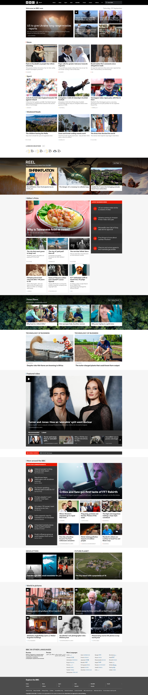

  #### Screenshot(s) van de tweede pagina (small screen):
  <a href="https://www.bbc.com/news">BBC News</a> 
  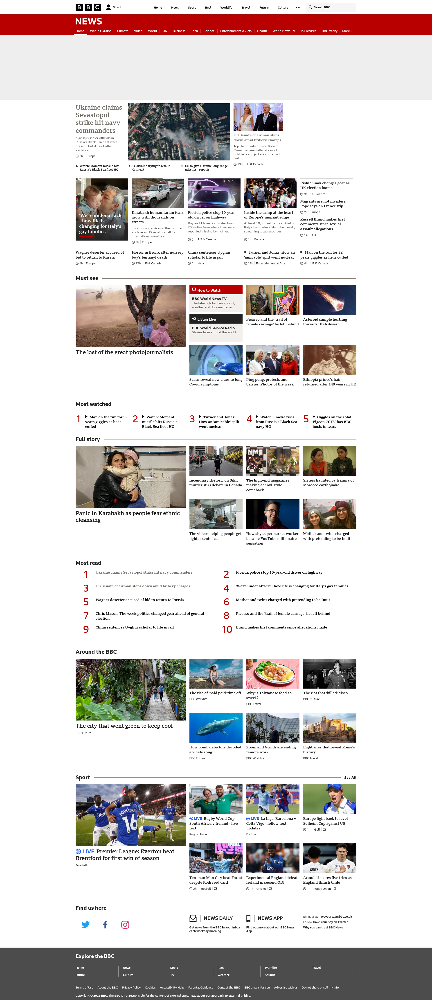
 

## Toegankelijkheidstest 1/2 (week 1)

  
uitwerken na test in 2e werkgroep

  ### Bevindingen
  Lijst met je bevindingen die in de test naar voren kwamen: 
  - Validator heeft 117 berichten waarvan 7 errors. 1 error is een img die geen alt heeft.
  - Heeft skip links naar de content en accessibility page.
  - lang attribute=en
  - focus state ziet uit als de regular focus state. geen speciale kleur bij toegevoegd.
  - High contrast wordt gesupport
  - images hebben een goed beschreven alt
  - headers zijn linkjes

  Cheatsheet screenreader  
  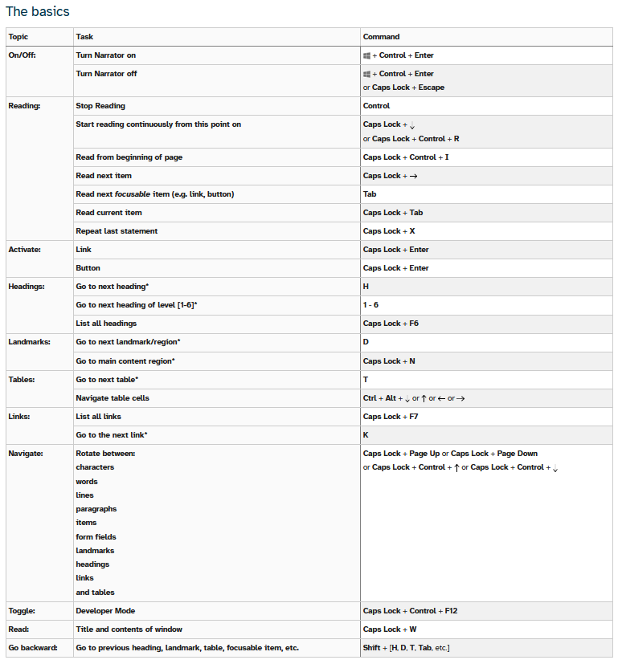
  

## Breakdownschets (week 1)

  
uitwerken na afloop 3e werkgroep

  ### de hele pagina: 
  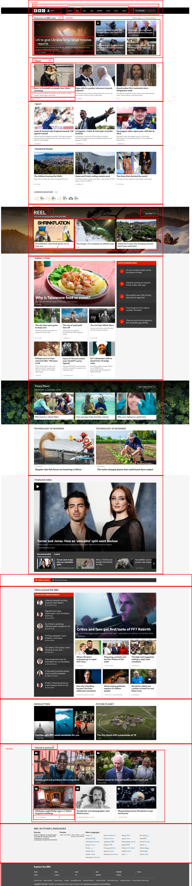

## Voortgang 1 (week 2)

  
uitwerken voor 1e voortgang

  ### Stand van zaken
  hier dit ging goed & dit was lastig (neem ook screenshots op van delen van je website en code).
  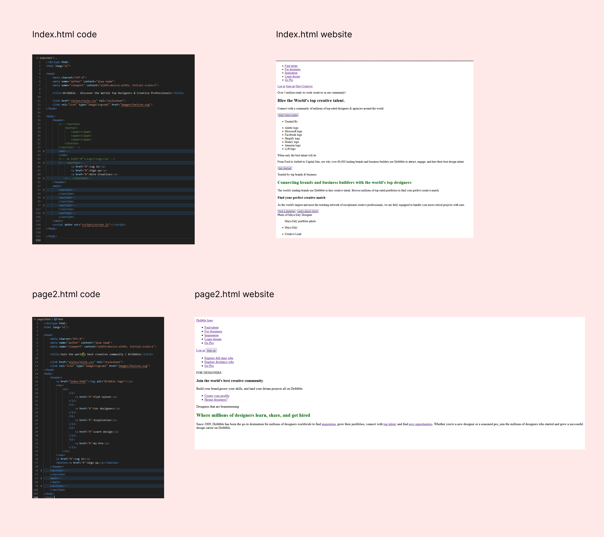

  ### Agenda voor meeting
  samen met je groepje opstellen

  | student 1      | student 2          | student 3    | student 4        |
  | ---            | ---                | ---          | ---              |
  | Waar kan ik het| Hoe gebruik je     | Hoe stel je  | Hoe werkt display|
  | beste beginnen | secties en         | de font in?  | flex nou?        |
  | met css'en?    | articles?          | ...          | ...              |

  ### Verslag van meeting
  hier na afloop snel de uitkomsten van de meeting vastleggen

  - Studentassistent vroeg wat ik uitdagend vond aan de website. Hierdoor ben ik van mening dat de beste keus is om een ander website te kiezen om na te maken.
  - na een section/ article hoort er altijd een h1/h2/h3 enzovoort als eerst bij. anders wordt het aangeraden om een div te gebruiken.
  - nog een punt
  - ...

## Voortgang 2 (week 3)

  
uitwerken voor 2e voortgang

  ### Stand van zaken
  hier dit ging goed & dit was lastig (neem ook screenshots op van delen van je website en code) 
  Ik heb de keuze gemaakt om de BBC website na te maken omdat hier meer uitdaging zit waaronder de nav vooral.
  Tot nu toe heb ik alleen de navigatie kunnen afmaken, maar dit was opzicht het moeilijkste van de website.  
  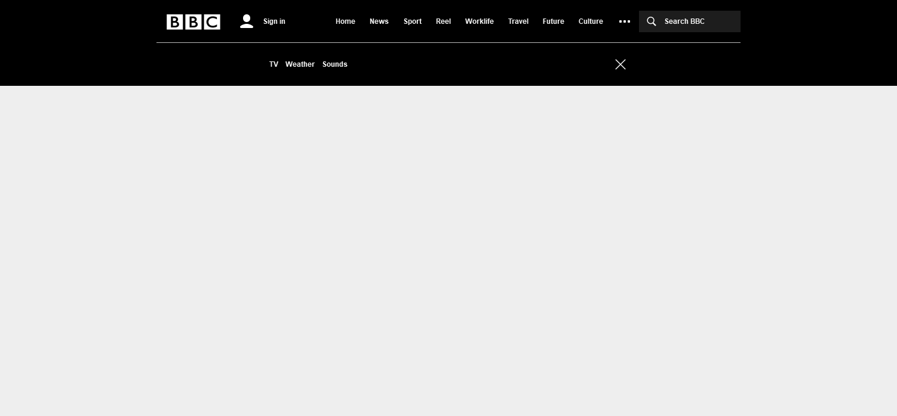 |  
  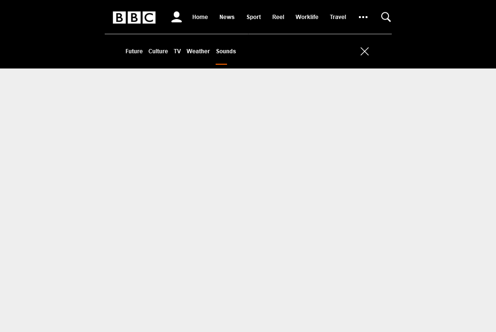 |  
  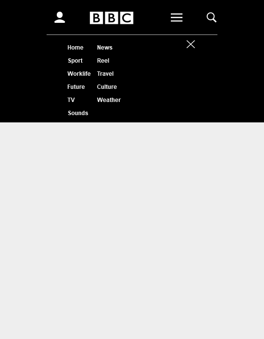
 
  ### Agenda voor meeting
  samen met je groepje opstellen

  | student 1      | student 2          | student 3    | student 4        |
  | ---            | ---                | ---          | ---              |
  | Hoe kan je     | Hoe werkt een      | Hoe gebruik  | en dan ik dat    |
  | binnen een sub | hamburger menu?    | je before en | dit wil ik zeker |
  | pagina een     | ...                | after?       | ...              |
  | scroll bij 
  | toevoegen?

  ### Verslag van meeting
  hier na afloop snel de uitkomsten van de meeting vastleggen

  - Met translate kan je gemakkelijk een menu laten verschijnen en verdwijnen.
  - ::before en ::after zijn elementen die content opslaan maar ook decoratief gebruikt kunnen worden.
  - Om alleen het element te selecteren dat alleen na de parent voorkomt, kan je gebruik maken van >. | header > nav
  - https://codepen.io/shooft/pen/dywdGqY - before en after
  - responsive menu: https://codepen.io/shooft/pen/KKbQVNy

## Toegankelijkheidstest 2/2 (week 4)

  
uitwerken na test in 9e werkgroep

  ### Bevindingen
  Lijst met je bevindingen die in de test naar voren kwamen (geef ook aan wat er verbeterd is): 
  - Validator heeft 7 errors waarvan allemaal images zonder alts zijn.
  - lang attribute = en.
  - geen skip links naar content en accessibility page.
  - viewport zoom is not disabled.
  - high contrast wordt gesupport.
  
  - Screenreader leest de headers niet op.
  - Headers horen linkjes te zijn.
  - De content wordt in listjes uitgesproken door de screenreader

  verbeterd:
  - De headers in een a gezet.
  - gebruik gemaakt van divs inplaats van listjes.
  - Alle images een alt gegeven.

  

## Voortgang 3 (week 4)

  
uitwerken voor 3e voortgang

  ### Stand van zaken
  hier dit ging goed & dit was lastig (neem ook screenshots op van delen van je website en code) 
  Ik heb tot nu toe de eerste pagina responsive kunnen krijgen. Alles ging tot nu toe goed. het is vooral begrijpen en zelf testen. 
  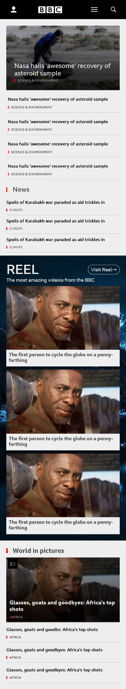 |  
  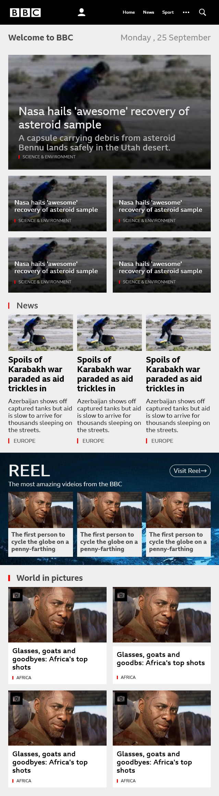 |  
  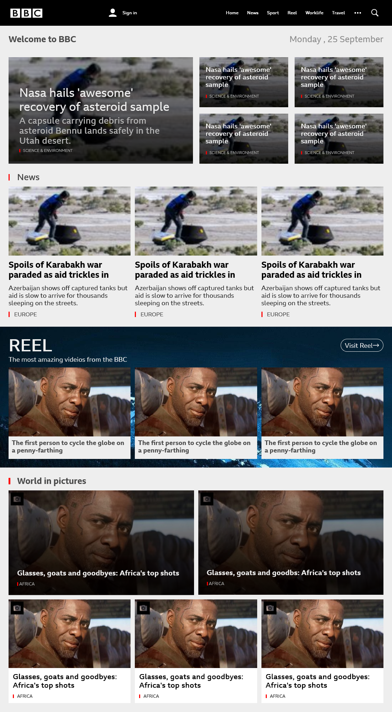  |  
  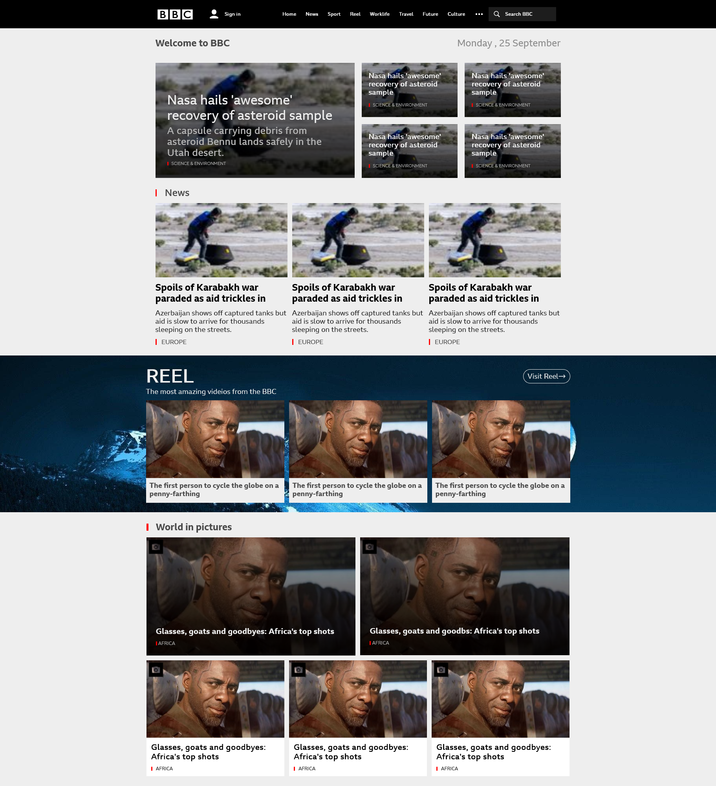

  ### Agenda voor meeting
  samen met je groepje opstellen

  | student 1      | student 2          | student 3    | student 4        |
  | ---            | ---                | ---          | ---              |
  | Hoe kan je     | Hoe werkt een      | Hoe gebruik  | en dan ik dat    |
  | binnen een sub | hamburger menu?    | je before en | dit wil ik zeker |
  | pagina een     | ...                | after?       | ...              |
  | scroll bij 
  | toevoegen?

  ### Verslag van meeting
  hier na afloop snel de uitkomsten van de meeting vastleggen

  - https://codepen.io/shooft/pen/dywdGqY - before en after
  - responsive menu: https://codepen.io/shooft/pen/KKbQVNy
  - nog een punt
  - ...

## Eindgesprek (week 5)

  
uitwerken voor eindgesprek

  ### Je uitkomst - karakteristiek screenshots:
    
  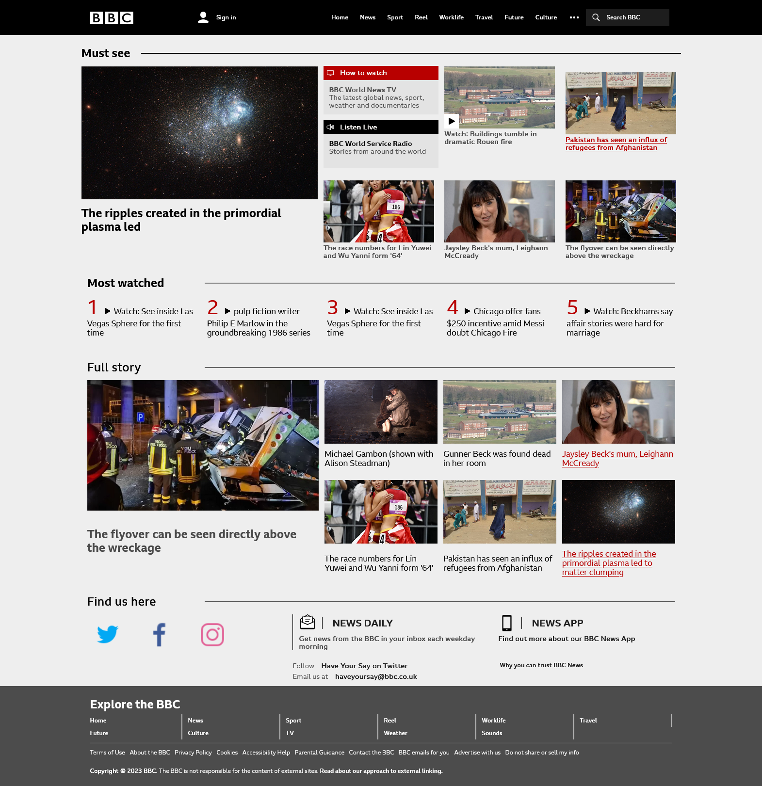

  ### Dit ging goed/Heb ik geleerd: 
  Korte omschrijving met plaatjes
  - Alles ging tot nu toe goed, ik heb gewerkt met grid/ flex, media queries, after & before, hover en nog veel meer. 
  - Ik voel me nu een css pro. Ook de selectors ging goed.

  ### Dit was lastig/Is niet gelukt:
  Ik had te weinig tijd om nog alle kleuren te veranderen. 
  - Omdat ik de pagina van desktop naar mobiel heb ontwikkeld, heeft dit nogal invloed gehad op de rest van de pagina, maar desondanks heb ik het wel kunnen fixen.
  - Er staan veel media queries die eigenlijk niet hoeven. Veel elementen met dezelfde attributes.
  - Met de kennis die ik nu heb kon ik de pagina's coderen met iets minder code.

  ### Laatste opdracht
  Problem: 
  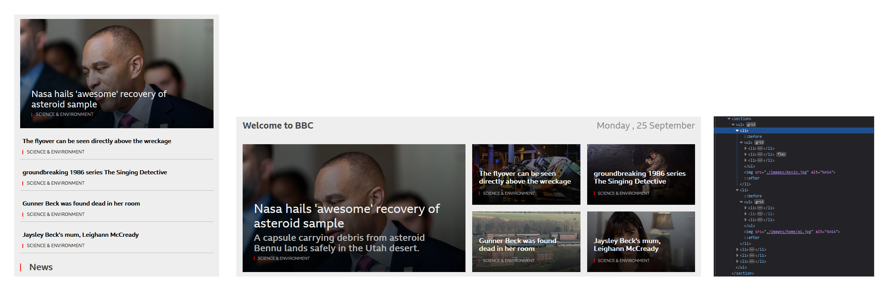  
  Solver: 
  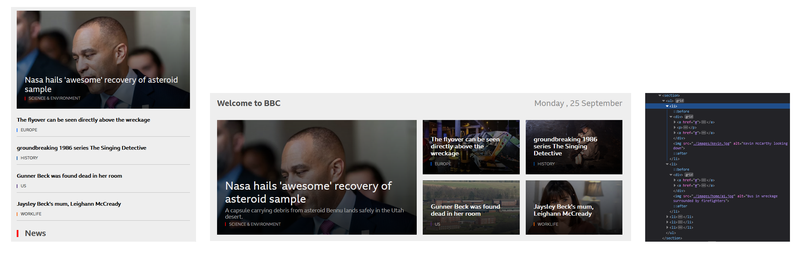

## Bronnenlijst

  
continu bijhouden terwijl je werkt

  Nb. Wees specifiek ('css-tricks' als bron is bijv. niet specifiek genoeg). 
  Nb. ChatGpT en andere AI horen er ook bij.
  Nb. Vermeld de bronnen ook in je code.

  1. :not | https://developer.mozilla.org/en-US/docs/Web/CSS/:not 
  2. ICONS | https://www.flaticon.com/free-icons, https://icons8.com/icon
  3. SPAN: INLINE BLOCK | https://stackoverflow.com/questions/67321358/how-do-i-exclude-span-inside-p-tag-while-applying-css
  4. URL IN CSS | https://sabe.io/blog/css-set-img-src
  5. https://tobiasahlin.com/blog/css-trick-animating-link-underlines/
  6. BBC-website guide-2021 | https://www.youtube.com/watch?v=F8ss3kjCp4I&t=178s
  7. CSS-guide | https://www.youtube.com/watch?v=rg7Fvvl3taU

